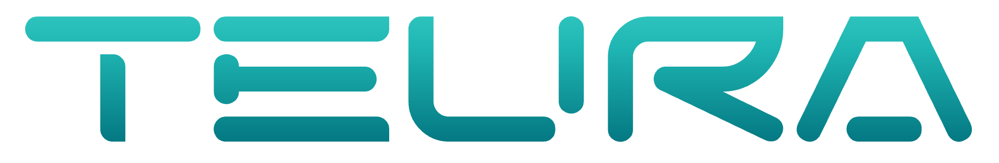

  

    
    <nav class="site-header__nav" aria-label="Primary">
      <a href="#home">Home</a>
      <a href="#offer">Offer</a>
      <a href="#team">Team</a>
      <a href="#contact">Contact</a>
    </nav>
    

  

## Home {#home .visually-hidden}

  
  

    Technology solutions provider
    From concept to end-product
    Your strategic R&D ally
  

## Offer {#offer .visually-hidden}

  <article class="offer-card">
    
SW

    

      <h3>Software Development</h3>
      
From the initial concept through development, deployment, and ongoing maintenance, we deliver agile, efficient, and effective solutions, bringing your business ideas to life in practical, ready-to-use form.

    

  </article>
  <article class="offer-card">
    
AI

    

      <h3>AI/ML Engineering</h3>
      
From problem discovery to model development, deployment, and monitoring. Practical, scalable, and secure. We build AI/ML solutions that deliver measurable business value.

    

  </article>
  <article class="offer-card">
    
Cloud

    

      <h3>Cloud management</h3>
      
End-to-end cloud and SaaS operations with CI/CD pipelines built for speed and reliability. Automated deployments, strong security controls, and full observability. We reduce downtime and operational overhead while improving release cadence.

    

  </article>
  <article class="offer-card">
    
PdM

    

      <h3>Predictive Maintenance</h3>
      
Smarter maintenance, fewer surprises. We detect anomalies early, predict breakdowns, and optimize service intervals, so operations stay stable and costs stay under control. We also develop production prediction solutions that support smarter scheduling, capacity planning, and operational decision-making.

    

  </article>

## Team {#team .visually-hidden}
<section class="team-highlight" aria-label="Team overview">
  

    

      <h2>TEAM</h2>
      
TEURA provides a comprehensive R&D service in the areas of Software Development, AI/ML Engineering, Cloud Management, and Predictive Maintenance. Our team is composed of PhD candidates specializing in automation, electronics, electrical engineering, and space technologies.

  By combining academic excellence with extensive industrial experience, we deliver end-to-end solutions. We bridge the gap between advanced research and production-grade engineering to drive operational efficiency and measurable business value for our partners.

    

    

      
    

  

</section>

<section class="contact-band" id="contact">
  

    

      <h2>Contact</h2>
      

        
Address

        
UL. ZURAWIA 71

        
15-540 BIALYSTOK

      

      <!-- 

        
Phone

        
+48 662 570 833

        
+48 669 529 781

      
 -->
      

        
Email

        
office@teura.eu

      

    

    

      <iframe
        title="TEURA location"
        src="https://www.openstreetmap.org/export/embed.html?bbox=23.148%2C53.106%2C23.201%2C53.134&amp;layer=mapnik&amp;marker=53.120%2C23.174"
        loading="lazy"
        referrerpolicy="no-referrer-when-downgrade"
      ></iframe>
    

  

</section>

<footer class="site-footer" role="contentinfo">
  

    

      

        <!-- <a href="https://www.linkedin.com" target="_blank" rel="noopener noreferrer">LinkedIn</a>
        <a href="https://www.facebook.com" target="_blank" rel="noopener noreferrer">Facebook</a>
        <a href="https://www.instagram.com" target="_blank" rel="noopener noreferrer">Instagram</a>
      
 -->
      

        © 2026 TEURA Sp. z o.o.
      

    

  

</footer>